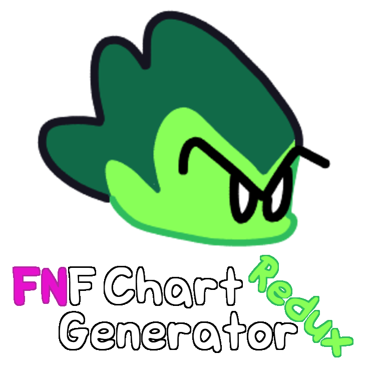

  

  
  
  

FNF Chart Generator Redux is an app for generating Friday Night Funkin' charts using only audio files.

## Quick Start
1. Open FNF Chart Generator Redux
2. Load audio files and configure Chart Settings
3. Generate chart
4. Save chart

For more information, please see [How to Use](docs/tutorial.md).

## Docs
- [How to Use](docs/tutorial.md)
- [Contribute](docs/contribute.md)

*If you find a bug, please report it in the Issues section.*

## License
FNF Chart Generator Redux is licensed under the APGL-3.0 license.

## Credits
FNF Chart Generator Redux was developed by MTGM. This app is based on Fnf Chart Creator by Mega2736 and inspired by [FNF Chart Generator Portable](https://gamebanana.com/tools/21707).